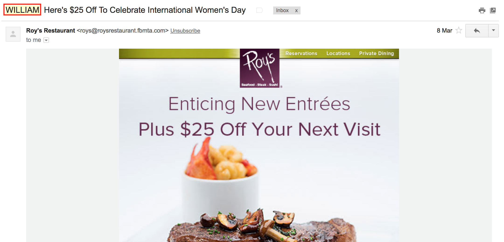
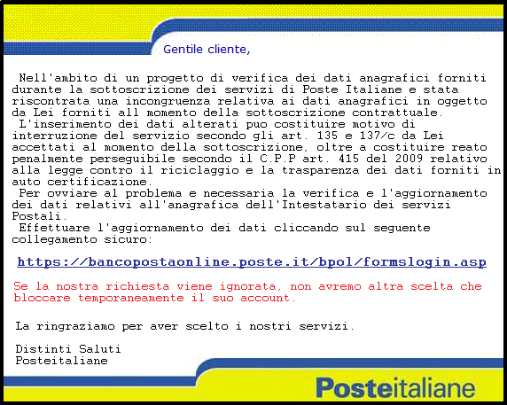
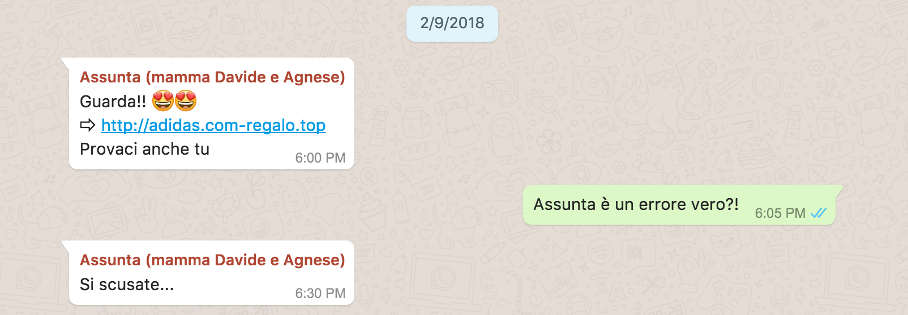

## Spam
La parola "spam" è usata per descrivere quelle email che sono state mandate ad un gran numero di persone, senza il permesso del destinatario e senza comunque che il destinatario abbia interesse a leggere queste email.

> La parola spam deriva da [questo](https://www.youtube.com/watch?v=anwy2MPT5RE) video di Monty Python.

Per esempio recentemente mi è arrivata questa email:

Io non conosco Roy's Resturant, né tantomeno mi sono mai iscritto a qualche servizio offerto da loro. Un altro indizio sospetto è che l'indirizzo del mittente finisce con fbmta.com, che non sembra avere alcun senso. Ma il dato determinante è quello che evidenziato con un rettangolo rosso in alto a sinistra, nell'oggetto: la mail è indirizzata a "William". Chi è William? Il fatto è che il mio indirizzo email inizia con "w", e siccome molti indirizzi hanno la prima lettera del nome e poi il cognome, il mittente ha ipotizzato che io mi chiamassi "William", il nome più comune con la w in America...Da tutto questo si deduce che questo messaggio è decisamente spam.

> Non sempre è possibile distinguere nettamente tra spam e pubblicità. Alcune email di pubblicità sono per noi utili, e anche gradite, se ci arrivano offerte interessanti. Quando però cominciano ad essere troppo frequenti, con contenuti di scarsa rilevanza per noi, si passa dalla pubblicità allo spam, ma può essere una cosa soggettiva.

Questa mail è indesiderata ma tuttavia abbastanza innocua (a parte lo spreco di banda, spazio sul disco e inquinamento ambientale). Ci sono altre email che sono molto più pericolose.

## Phishing
Le email di phishing sono a tutti gli effetti un tentativo di _truffa_. Il caso più comune è un mittente che simula, nella grafica e nel contenuto, una istituzione nota, come ad esempio le poste o una banca. Chi riceve la mail, se non si accorge della truffa, clicca su un link presente e si ritrova su una pagina contraffatta. Se inserisce password o altri dati sensibili su questa pagina, sicuramente passerà dei guai.

A volte è semplice accorgersi del phishing, perché i testi sono in un italiano poco corretto o le immagini sgranate. Ma altre volte non è banale. Vediamo un esempio:

Questa mail sembra credibile. Anche il link sembra quello ufficiale. Ma **attenzione**: nella realtà quando andate a cliccare su quel link vi porta su una pagina con un indirizzo diverso! Infatti il testo del link può essere diverso dal link stesso: ad esempio questo link [www.google.com](http://www.veneziacomics.com/files/veneziacomics.com/2016/02/10636612_10153724437910700_8664823752192133128_o.jpg) non porta dove ci si aspetta! Quindi **fate sempre molta attenzione prima di cliccare su qualcosa**.

### Phishing su Whatsapp
Un altro caso di phishing che mi è capitato qualche tempo fa su Whatsapp è stato questo:

In questo caso è più evidente che si tratta di un errore, perché il sito ha un indirizzo alquanto strano.

## Malware
Il malware è un messaggio inviato con l'intento di fare un danno sulla macchina del destinatario. Un esempio recentissimo e che ha fatto storia è stato il carattere indiano che mandava in crash i dispositivi Apple.

Se un messaggio contente questo carattere è stato mandato con l'esplicito intento di fare un danno, può essere considerato a tutti gli effetti un malware.

Anche in questo caso, fate sempre attenzione quando ricevete una **mail sospetta**: se contiene un allegato, **non** apritelo. Se non siete sicuri, inviate una mail al mittente chiedendo se è sicuro aprire l'allegato. Se questo per qualche motivo non fosse possibile, semplicemente ignorate il messaggio: meglio rimanere con la curiosità che perdere ore o giorni a rimettere a posto il vostro dispositivo o, peggio, fare da veicolo di infezione per altre persone.
