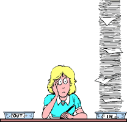

# Email

Le email (dette anche e-mail, o electronic mail, letteralmente _posta elettronica_) è stato uno dei primi utilizzi della rete di calcolatori. Pensate che ancora negli anni '80, per inviare una comunicazione scritta ad un collega l'unico modo era inviare una lettera, o scrivere dei foglietti che andavano nei famosi _in basket_.

Poter mandare un messaggio in maniera digitale era molto più comodo, veloce ed economico. Fin troppo: le email sono state il primo mezzo di comunicazione con cui era possibile inviare un messaggio a decine, centinaia o anche migliaia di persone contemporaneamente, sparse per tutto il globo, ad un prezzo praticamente irrisorio. Questo ha creato necessariamente una serie di problemi, che persistono tuttora, alcuni dei quali sono descritti di seguito. **Attenzione**: alla maggior parte di questi problemi non c'è una soluzione "tecnica". Il corretto uso delle email e dei messaggi è _responsabilità_ di chi li usa, ovvero chi li manda, ma anche chi li riceve, come vedremo tra poco.

> Molti dei problemi descritti qui sotto per le email, cominciano a diffondersi anche su altri canali di messaggi, come ad esempio Whatsapp. Quindi fate sempre attenzione ai messaggi che ricevete!
